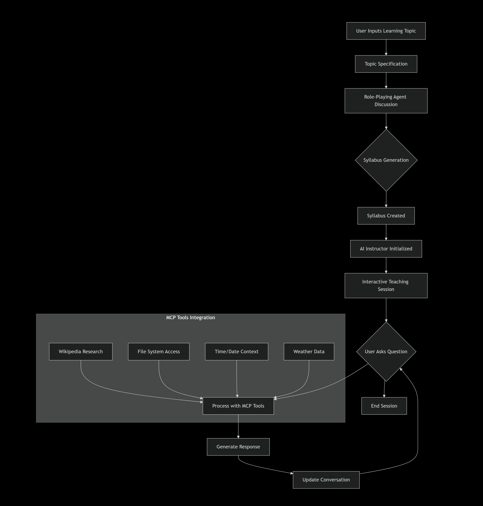

# 🎓 EduGPT - Your AI Instructor with MCP Tools

EduGPT is an advanced AI-powered educational platform that creates personalized course syllabi and provides interactive teaching using Google Gemini AI and MCP (Model Context Protocol) tools.

## ✨ Features

- 🤖 **AI-Powered Syllabus Generation**: Create comprehensive course outlines automatically
- 👨‍🏫 **Interactive AI Instructor**: Personalized, adaptive teaching sessions
- 🛠️ **MCP Tools Integration**: Real-time Wikipedia research, file system access, and more
- 🎯 **Multi-Subject Support**: From programming to humanities
- 💬 **Web Interface**: User-friendly Gradio interface
- 🔧 **Extensible Architecture**: Easy to add new tools and features

## Workflow


## 🚀 Quick Start

### Prerequisites

- Python 3.10+
- Node.js 16+ (for MCP tools)
- pip package manager
- Google Gemini API key

### Installation

1. **Clone the repository**:
   ```bash
   git clone https://github.com/your-username/EduGPT.git
   cd EduGPT


2. **Install Dependencies**:
   
       pip install -r requirements.txt

4. **Set up env**:
   
         cp .env.example .env
         # Edit .env with your API keys and configuration

6. **Run the Application**:

         python app.py

Usage:
Web Interface
Access the web interface at (http://localhost:5000) after starting the application.


API Endpoints:
POST /api/chat - Send messages to EduGPT
GET /api/subjects - Get available subjects
POST /api/assessment - Create personalized assessments

**Example Usage:**
      
      from edugpt import EduGPT
      assistant = EduGPT()
      response = assistant.ask_question("Explain quantum physics in simple terms")
      print(response)


Configuration
**Configure EduGPT by modifying the config.yaml file:**
         
         model:
           name: "gpt-4"
           temperature: 0.7
           max_tokens: 1000
         
         education:
           subjects: ["math", "science", "history", "literature"]
           difficulty_levels: ["beginner", "intermediate", "advanced"]
           
         ui:
           theme: "light"
           language: "en"
           
Acknowledgments
**Built with cutting-edge AI technologies**
**Inspired by modern educational needs**


